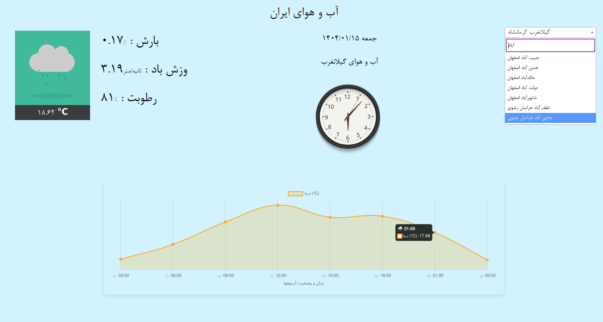

# 🇮🇷 Iran Weather App

A simple and beautiful web application to display weather information for cities in Iran. It shows current temperature, weather condition, humidity, precipitation, and wind speed. Built using Laravel, Chart.js, Select2, and the OpenWeatherMap API.

## 🖼 Project Preview

| IRAN weather project                                | 
|-----------------------------------------------------|
|  |
## ⚙️ Features

- Searchable list of Iranian cities
- Current temperature in Celsius
- Humidity, precipitation, and wind speed
- Animated weather transitions (day/night, rain, etc.)
- Temperature chart for the next hours

## 🚀 Installation & Setup

### Requirements

- PHP >= 8.1
- Composer
- Node.js + NPM
- Laravel 10+


### Installation Steps

```bash
git clone https://github.com/rshoorvazi/weather.git
cd weather

# Install dependencies
composer install
npm install && npm run dev

# Set up environment variables
cp .env.example .env
php artisan key:generate
php artisan migrate
php artisan db:seed
```

## 🌐 Weather API

The app uses OpenWeatherMap API for weather data.

    Sign up on OpenWeatherMap to get your API key.

    Add it to your .env file:

    OPENWEATHER_API_KEY=your_api_key_here

## 🤝 Contributing

Pull requests are welcome! If you'd like to improve or add new features, feel free to contribute.

## 📄 License

MIT © reza shoorvazi


